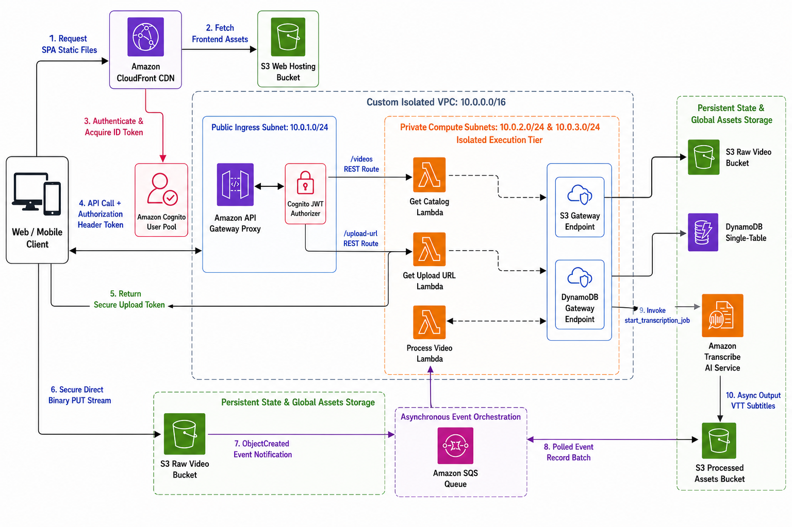
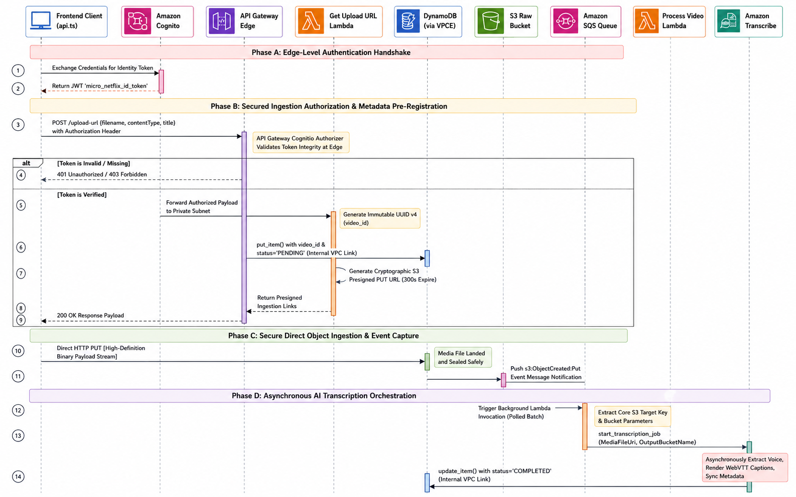

# Micro-Netflix

A cloud-native video streaming application that lets users sign in, upload MP4 videos, browse a searchable catalog, and play videos with generated metadata through a serverless AWS architecture.

## Table of Contents

- [Overview](#overview)
- [Features](#features)
- [Technology Stack](#technology-stack)
- [Project Structure](#project-structure)
- [Quick Start](#quick-start)
- [API Documentation](#api-documentation)
- [Development](#development)
- [Deployment](#deployment)
- [Testing](#testing)
- [Contributing](#contributing)

## Overview

Micro-Netflix is a term-project streaming platform built around AWS managed services. The frontend is a React/Vite single-page app, while the backend uses API Gateway, Lambda, S3, SQS, DynamoDB, Cognito, and optional Redis caching to provide an event-driven upload and catalog workflow.

### Key Benefits

- **Serverless backend:** API and processing workloads run on AWS Lambda.
- **Secure access:** Amazon Cognito protects upload and catalog APIs.
- **Direct-to-S3 uploads:** Users upload large video files through short-lived presigned URLs.
- **Event-driven processing:** S3 upload events flow through SQS into a processing Lambda.
- **Searchable catalog:** DynamoDB stores video metadata, processing status, captions, thumbnails, and AI summaries.
- **Cloud deployment:** Terraform provisions the full AWS architecture and deployment outputs.

## Features

### Authentication & Security

- Cognito hosted UI login and logout
- JWT ID token storage in the browser
- Cognito authorizer protection for API Gateway routes
- S3 server-side encryption and bucket public access controls
- VPC, subnets, route tables, and AWS service endpoints managed by Terraform

### Video Upload Workflow

- MP4 upload registration through the backend API
- Presigned S3 upload URLs for videos
- Browser-generated thumbnail capture
- Presigned S3 upload URLs for thumbnails
- DynamoDB pre-registration with `PENDING` processing status

### Catalog & Playback

- Paginated video catalog
- Search by title, original filename, summary, and processing status
- Signed playback URLs or CDN-ready URL generation
- Thumbnail previews
- WebVTT caption track support
- Video detail view with AI summary and processing state

### Event-Driven Processing

- S3 object-created notifications for uploaded MP4 files
- SQS processing queue with dead-letter queue
- Lambda processing worker for metadata updates
- Amazon Comprehend keyword extraction fallback
- Generated WebVTT captions for processed videos

### Operations & Reliability

- DynamoDB point-in-time recovery
- S3 versioning and lifecycle transition for raw uploads
- CloudWatch alarm for SQS queue backlog
- Optional ElastiCache Redis catalog cache
- One-command deployment script for infrastructure and static frontend publishing

## Technology Stack

### Frontend

- **Framework:** React 19
- **Build Tool:** Vite 8
- **Language:** TypeScript 6
- **HTTP/API:** Fetch API
- **Authentication:** Amazon Cognito hosted UI
- **Deployment Target:** S3 static website assets, with EC2/CodeDeploy files also included

### Backend

- **Runtime:** Python 3.11 on AWS Lambda
- **AWS SDK:** boto3
- **API Layer:** Amazon API Gateway REST API
- **Authentication:** Amazon Cognito user pool authorizer
- **Storage:** Amazon S3
- **Database:** Amazon DynamoDB
- **Queueing:** Amazon SQS with DLQ
- **AI Metadata:** Amazon Comprehend keyword extraction
- **Cache:** Optional ElastiCache Redis

### Infrastructure & DevOps

- **Infrastructure as Code:** Terraform >= 1.5
- **Cloud Provider:** AWS
- **Static Hosting:** S3 website bucket
- **Deployment Automation:** Bash scripts + AWS CLI
- **Optional Server Deployment:** EC2, Nginx, CodeDeploy

## Project Structure

```text
Micro_Netflix/
|-- architecture/                  # Architecture and data-flow diagrams
|   |-- architecture.png
|   `-- data_flow.png
|
|-- backend/                       # Python Lambda source
|   |-- api_handlers/              # API Gateway Lambda handlers
|   |   |-- get_catalog.py
|   |   `-- get_upload_url.py
|   |-- workers/                   # Background worker Lambda source
|   |   `-- process_video.py
|   `-- requirements.txt           # Python dependencies
|
|-- frontend/                      # React + TypeScript client
|   |-- src/
|   |   |-- components/            # Video dashboard UI
|   |   |-- services/              # API client helpers
|   |   |-- App.tsx
|   |   `-- main.tsx
|   |-- scripts/                   # CodeDeploy build hook
|   |-- package.json
|   `-- appspec.yml
|
|-- infrastructure/                # Terraform AWS infrastructure
|   |-- api.tf                     # API Gateway routes and Lambda integrations
|   |-- auth.tf                    # Cognito user pool and hosted UI
|   |-- cache.tf                   # Optional Redis cache
|   |-- compute.tf                 # Lambda packaging and functions
|   |-- frontend.tf                # Frontend hosting and CodeDeploy resources
|   |-- main.tf                    # Core S3, API, and DynamoDB resources
|   |-- pipeline_components.tf     # SQS, DLQ, processor, lifecycle, alarms
|   |-- providers.tf
|   |-- variables.tf
|   `-- outputs.tf
|
|-- scripts/
|   `-- deploy-static-site.sh      # Main automated deployment script
|-- automate-deploy.sh             # Wrapper around the deployment script
`-- README.md
```

## Quick Start

### Prerequisites

Cloud Requirements:

- AWS account or AWS Academy Learner Lab environment
- AWS CLI configured with active credentials
- Terraform 1.5+
- Existing IAM role named `LabRole`
- Existing instance profile named `LabInstanceProfile` if using the EC2/CodeDeploy path

Local Development Requirements:

- Node.js 20+
- npm
- Python 3.11+
- Bash-compatible shell for deployment scripts

### One-Command Deployment

From the project root:

```bash
bash scripts/deploy-static-site.sh
```

This script:

- Runs `terraform init`
- Applies the AWS infrastructure
- Reads Terraform outputs
- Writes `frontend/.env` and `frontend/.env.production`
- Installs frontend dependencies
- Builds the React app
- Publishes `frontend/dist` to the provisioned S3 frontend bucket

To deploy without Redis cache:

```bash
ENABLE_REDIS_CACHE=false bash scripts/deploy-static-site.sh
```

### Manual Infrastructure Setup

```bash
cd infrastructure
terraform init
terraform apply -var "enable_redis_cache=true"
```

Useful outputs:

```bash
terraform output api_base_url
terraform output frontend_url
terraform output cognito_user_pool_id
terraform output cognito_user_pool_client_id
terraform output cognito_hosted_ui_domain
terraform output frontend_site_bucket
```

### Frontend Local Setup

Create `frontend/.env` using Terraform outputs:

```env
VITE_API_BASE_URL=<api_base_url>
VITE_COGNITO_CLIENT_ID=<cognito_user_pool_client_id>
VITE_COGNITO_DOMAIN=<cognito_hosted_ui_domain>
VITE_APP_URL=http://localhost:5173
```

Run the app:

```bash
cd frontend
npm install --legacy-peer-deps
npm run dev
```

The local frontend runs at:

```text
http://localhost:5173
```

## API Documentation

### Base URL

Development and production API base URLs are generated by Terraform:

```bash
cd infrastructure
terraform output -raw api_base_url
```

### Authentication

Protected endpoints require a Cognito ID token in the `Authorization` header:

```http
Authorization: <cognito-id-token>
```

### Key Endpoints

#### Upload Registration

```http
POST /upload-url
```

Request body:

```json
{
  "filename": "movie.mp4",
  "contentType": "video/mp4",
  "title": "Movie Title"
}
```

Response:

```json
{
  "upload_url": "https://...",
  "video_id": "uuid",
  "s3_key": "uuid.mp4",
  "thumbnail_upload_url": "https://...",
  "thumbnail_key": "thumbnails/uuid.jpg",
  "title": "Movie Title"
}
```

#### Catalog

```http
GET /videos?limit=12&search=movie&nextToken=<token>
```

Response:

```json
{
  "videos": [
    {
      "video_id": "uuid",
      "title": "Movie Title",
      "streaming_url": "https://...",
      "caption_track_url": "https://...",
      "thumbnail_url": "https://...",
      "ai_summary": "Automated smart summary...",
      "processing_status": "COMPLETED"
    }
  ],
  "nextToken": null
}
```

## Development

### Frontend Development

```bash
cd frontend
npm run dev
```

Build production assets:

```bash
cd frontend
npm run build
```

Run linting:

```bash
cd frontend
npm run lint
```

### Backend Development

Install Python dependencies:

```bash
cd backend
python -m pip install -r requirements.txt
```

The backend code is designed for AWS Lambda. Local testing typically requires mocked AWS services or a configured AWS account with the expected S3, DynamoDB, Cognito, and SQS resources.

### Infrastructure Development

Validate Terraform:

```bash
cd infrastructure
terraform fmt
terraform validate
```

Preview changes:

```bash
cd infrastructure
terraform plan
```

## Deployment

### Static Frontend Deployment

Recommended path:

```bash
bash scripts/deploy-static-site.sh
```

The script publishes the Vite build output directly to the Terraform-managed S3 frontend bucket.

### CodeDeploy Assets

The repository also includes EC2/CodeDeploy support:

- `frontend/appspec.yml`
- `frontend/scripts/build_and_deploy.sh`
- `infrastructure/frontend.tf`

This path provisions an Ubuntu EC2 instance with Nginx and the CodeDeploy agent. The current primary deployment path is the S3 static website script.

### Infrastructure Notes

- AWS region defaults to `us-east-1`.
- Project resource prefix defaults to `micro-netflix`.
- Some S3 bucket names are explicit and must be globally unique in AWS.
- CloudFront is intentionally omitted because AWS Learner Lab commonly blocks CloudFront distribution creation.
- Redis can be disabled with `enable_redis_cache=false` if the Learner Lab environment does not support ElastiCache.

## Testing

### Frontend Checks

```bash
cd frontend
npm run lint
npm run build
```

### Terraform Checks

```bash
cd infrastructure
terraform fmt
terraform validate
terraform plan
```

### Backend Checks

```bash
cd backend
python -m pip install -r requirements.txt
python -m py_compile api_handlers/get_upload_url.py api_handlers/get_catalog.py workers/process_video.py
```

## Architecture

### High-Level Architecture



### Data Flow



## Contributing

### Development Workflow

1. Create a feature branch.
2. Make focused changes.
3. Run frontend, backend, and Terraform checks.
4. Update documentation when infrastructure, APIs, or environment variables change.
5. Open a pull request with a short summary and validation notes.

### Code Standards

- **Frontend:** Keep components typed, focused, and consistent with the existing dashboard structure.
- **Backend:** Keep Lambda handlers small and explicit about AWS environment variables.
- **Infrastructure:** Use Terraform formatting, clear resource names, and outputs for values consumed by the frontend.
- **Documentation:** Keep setup commands and required AWS assumptions current.
